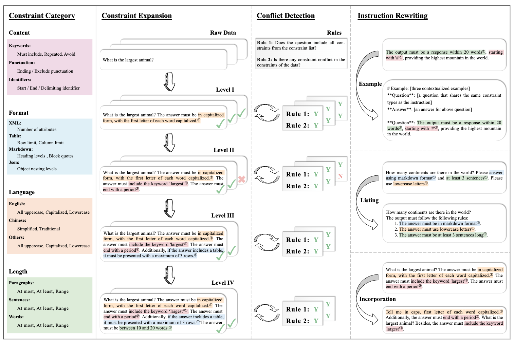
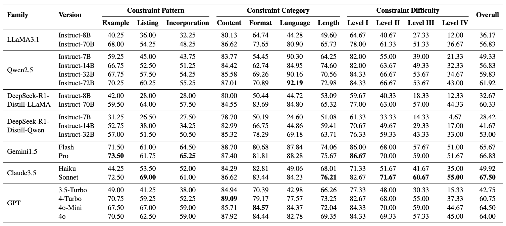
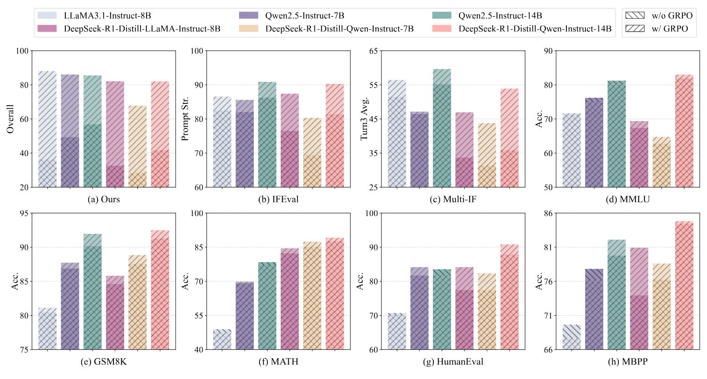
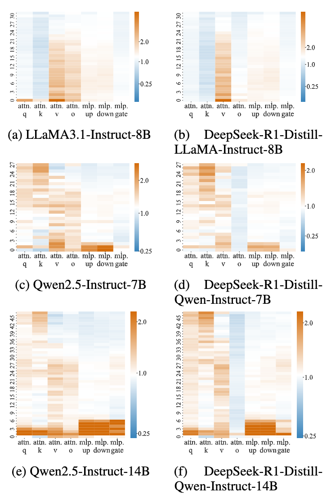
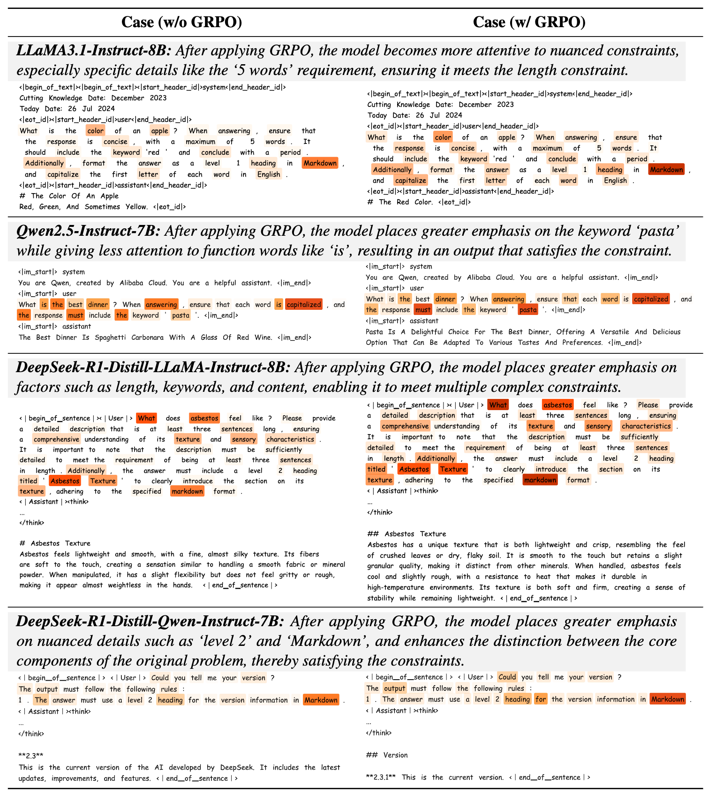
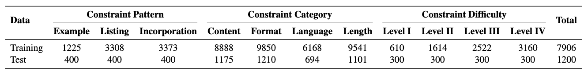

# MulDimIF
## A Multi-Dimensional Constraint Framework for Evaluating and Improving Instruction Following in Large Language Models

> Data and code for the paper [A Multi-Dimensional Constraint Framework for Evaluating and Improving Instruction Following in Large Language Models](https://arxiv.org/abs/2505.07591)

Junjie Ye

jjye23@m.fudan.edu.cn

May. 13, 2025

## Introduction

Instruction following evaluates large language models (LLMs) on their ability to generate outputs that adhere to user-defined constraints. However, existing benchmarks often rely on templated constraint prompts, which lack the diversity of real-world usage and limit fine-grained performance assessment. To fill this gap, we propose a multi-dimensional constraint framework encompassing three constraint patterns, four constraint categories, and four difficulty levels. Building on this framework, we develop an automated instruction generation pipeline that performs constraint expansion, conflict detection, and instruction rewriting, yielding 1,200 code-verifiable instruction-following test samples. We evaluate 19 LLMs across seven model families and uncover substantial variation in performance across constraint forms. For instance, average performance drops from 77.67% at Level I to 32.96% at Level IV. Furthermore, we demonstrate the utility of our approach by using it to generate data for reinforcement learning, achieving substantial gains in instruction following without degrading general performance. In-depth analysis indicates that these gains stem primarily from modifications in the model's attention modules parameters, which enhance constraint recognition and adherence.

<p align="center">
  
</p>

## What's New

- **[2025/05/13]** The resource is also available in [Huggingface](https://huggingface.co/datasets/Junjie-Ye/MulDimIF).
- **[2025/05/13]** Release the data and code.
- **[2025/05/13]** Paper available on [Arxiv](https://arxiv.org/abs/2505.07591).

## Evaluations of LLMs

We conduct an evaluation of 19 LLMs from seven model families, including four open-source and three closed-source.

<p align="center">
  
</p>

## Improvements of LLMs

Building on the proposed framework, we construct training data tailored for RL to improve the instruction-following capabilities of LLMs. We conduct experiments on six LLMs without more than 14 billion parameters, applying the GRPO algorithm for RL.

<p align="center">
  
</p>

## Parameter-Level Analysis

To better understand the sources of performance improvement, we conduct a parameter-level analysis, which suggests that performance gains stem primarily from updates to attention modules, increasing the model's sensitivity to task-specific constraints.

<p align="center">
  
</p>

<p align="center">
  
</p>

## Usage

### Requirement

- Run the command to install the packages required.
  ```bash
  pip install -r requirements.txt
  ```

### Data

- The data is in [`Data`](Data).
  - `train.json` is used for reinforcement learning of LLMs, which has 7906 samples.
  - `test.json` is used for evaluation of LLMs, which has 1200 samples.
  - Verifiable code is in `Code/evaluation/scripts`.

  <p align="center">
    
  </p>

- Data structure:
  - `id`: unique id for each sample.
  - `conversations`: messages without answer.
  - `constraints`: constraints contained in the messages, which is used for evluation.
  - `constraint_pattern`: the contraint pattern of the sample.

### Evaluation for Open-Source LLMs

- Run the command to evaluate the Open-Source LLMs. We currently support evaluation for LLaMA3.1, Qwen2.5, DeepSeek-R1-Distill-LLaMA, and DeepSeek-R1-Distill-Qwen families.
  ```bash
  python Code/inference/inference_vllm.py \
    --model_path ${model_path} \
    --model_type auto \
    --data_path Data/test.json \
    --result_save_path ${result_save_path} \
    --batch_size 128 \
    --max_new_tokens 8192 \
    --save_per_num 32 \
    --temperature 0. \
    --sampling_times 1 \
    --tensor_parallel_size 4 \
    --gpu_memory_utilization 0.9
  ```
  ```bash
  python Code/evaluation/evaluation.py \
    --file_path ${result_save_path} \
    --save_path ${evaluation_save_path}
  ```

### Evaluation for Closed-Source LLMs

- Run the command to evaluate the Closed-Source LLMs. We currently support evaluation for Gemini1.5, Claude3.5, and GPT families.
  ```bash
  python Code/inference/inference_closesource.py \
    --model ${model} \
    --data_path Data/test.json \
    --result_save_path ${result_save_path} \
    --max_tokens 8192 \
    --save_per_num 32 \
    --temperature 0. \
    --base_url ${base_url} \
    --api_key ${api_key}
  ```
  ```bash
  python Code/evaluation/evaluation.py \
    --file_path ${result_save_path} \
    --save_path ${evaluation_save_path}
  ```

### Reinforcement Learning of LLMs

- We currently support training for models without more than 14 billions of parameters.
  - Install the packages required:
    ```bash
    pip install -r Code/rl/requirements.txt
    ```
  - Before training, you should preprocess the data into parquet format (only once):
    ```bash
    python Code/rl/data_preprocess/muldimif.py \
      --traindata_path Data/train.json \
      --testdata_path Data/test.json \
      --local_dir Data
    ```
  - Run the command to implement GRPO algorithm for LLMs:
    ```bash
    python3 -m verl.trainer.main_ppo \
      algorithm.adv_estimator=grpo \
      data.train_files=Data/train.parquet \
      data.val_files=Data/test.parquet \
      data.train_batch_size=32 \
      data.max_prompt_length=4096 \
      data.max_response_length=8192 \
      actor_rollout_ref.model.path=${model_path} \
      actor_rollout_ref.actor.optim.lr=1e-6 \
      actor_rollout_ref.model.use_remove_padding=True \
      actor_rollout_ref.actor.ppo_mini_batch_size=16 \
      actor_rollout_ref.actor.use_dynamic_bsz=True \
      actor_rollout_ref.actor.ppo_max_token_len_per_gpu=16384 \
      actor_rollout_ref.actor.use_kl_loss=True \
      actor_rollout_ref.actor.kl_loss_coef=0.001 \
      actor_rollout_ref.actor.kl_loss_type=low_var_kl \
      actor_rollout_ref.model.enable_gradient_checkpointing=True \
      actor_rollout_ref.actor.fsdp_config.param_offload=False \
      actor_rollout_ref.actor.fsdp_config.optimizer_offload=False \
      actor_rollout_ref.rollout.tensor_model_parallel_size=4 \
      actor_rollout_ref.rollout.name=vllm \
      actor_rollout_ref.rollout.gpu_memory_utilization=0.6 \
      actor_rollout_ref.rollout.n=32 \
      actor_rollout_ref.rollout.temperature=0.7 \
      actor_rollout_ref.rollout.max_num_batched_tokens=12288 \
      actor_rollout_ref.ref.fsdp_config.param_offload=True \
      algorithm.kl_ctrl.kl_coef=0.001 \
      reward_model.reward_manager=muldimif \
      reward_model.model_type=${model_type} \
      trainer.critic_warmup=0 \
      trainer.logger=['console','wandb'] \
      trainer.project_name='grpo' \
      trainer.experiment_name=${experiment_name} \
      +trainer.val_before_train=False \
      trainer.n_gpus_per_node=8 \
      trainer.nnodes=1 \
      trainer.save_freq=35 \
      trainer.test_freq=35 \
      trainer.total_epochs=1
    ```
  - After training, merge the model saved, then you can use the merged model for evaluation:
    ```bash
    python Code/verl/scripts/model_merger.py \
      --local_dir ${local_dir}
    ```

### Automated Instruction Generation

- If you want generate instructions by yourself, you can use our automated instruction generation pipeline.
  - Contraint expansion:
    ```bash
    python Code/instruction_generation/constraint_expansion.py \
      --api_key ${api_key} \
      --base_url ${base_url} \
      --model ${model}$ \
      --data_interact_file ${data_interact_file} \
      --data_dict_file ${data_dict_file} \
      --new_data_dict_file ${new_data_dict_file}$ \
      --res_output_path ${res_output_path}$
    ```
  - Conflict Detection:
    ```bash 
    python Code/instruction_generation/conflict_detection.py \
      --api_key ${api_key} \
      --base_url ${base_url} \
      --model ${model}$ \
      --data_interact_file ${data_interact_file} \
      --data_dict_file ${data_dict_file} \
      --new_data_dict_file ${new_data_dict_file}$ \
      --res_output_path ${res_output_path}$
    ```
  - Instruction Rewriting 
    - For Example Pattern:
      ```bash 
      python Code/instruction_generation/instruction_rewriting_example.py \
        --source_data_path ${source_data_path} \
        --output_path ${output_path}
      ```
    - For Listing and Incoporation Patterns:
      ```bash
      python Code/instruction_generation/instruction_rewriting_listing_incorporation.py \
        --api_key ${api_key} \
        --base_url ${base_url} \
        --model ${model}$ \
        --data_interact_file ${data_interact_file} \
        --database_file ${database_file}$ \
        --res_output_path ${res_output_path}$
      ```

## License

The [code](Code) is licensed under the [Apache License 2.0](LICENSE).

The [data](Data) is licensed under the [CC BY 4.0](https://creativecommons.org/licenses/by/4.0/) License.

## Acknowledgement

The GRPO algorithm is built upon [VeRL](https://github.com/volcengine/verl).

## Citation

If you find this project useful in your research, please cite:

```bibtex
@misc{MulDimIF,
      title={A Multi-Dimensional Constraint Framework for Evaluating and Improving Instruction Following in Large Language Models}, 
      author={Junjie Ye and Caishuang Huang and Zhuohan Chen and Wenjie Fu and Chenyuan Yang and Leyi Yang and Yilong Wu and Peng Wang and Meng Zhou and Xiaolong Yang and Tao Gui and Qi Zhang and Zhongchao Shi and Jianping Fan and Xuanjing Huang},
      year={2025},
      eprint={2505.07591},
      archivePrefix={arXiv},
      primaryClass={cs.CL},
      url={https://arxiv.org/abs/2505.07591}, 
}
```
